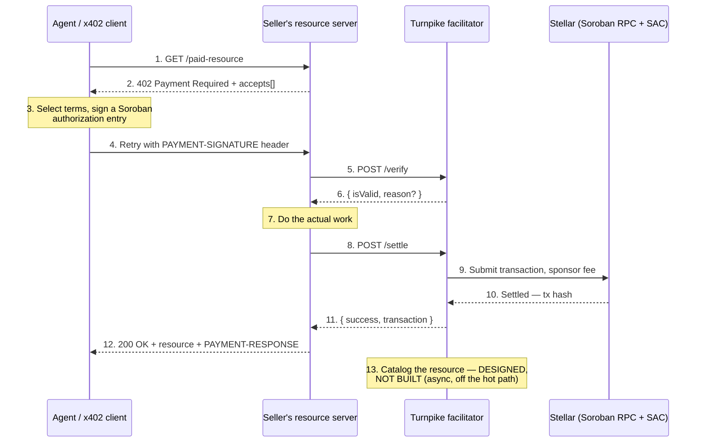

# How it works

This page traces a single payment from an agent's first request to a settled transaction on Stellar, then explains the Stellar-specific mechanics that make it possible.

---

## The payment lifecycle

### Step by step

**1 — 2. The 402 response.** The agent requests a protected resource and receives HTTP `402`. In x402 v2 the terms travel in the `PAYMENT-REQUIRED` response header as base64-encoded JSON, not in the body — the body is empty. That object carries an `accepts` array, and each entry describes one acceptable way to pay: the scheme, the network, the asset contract, the amount in atomic units, the recipient, and a validity window. A server may offer several entries and the client picks one. *(Anything parsing the body for `accepts` is reading x402 v1.)*

Turnpike advertises `exact` on `stellar:testnet` today; `upto` and `stellar:pubnet` are designed, not built.

The same header carries the resource metadata that would feed discovery — a description, a MIME type, a route template. That is the point at which a catalogue *would* learn what a resource is; the catalogue itself is not built.

**3. Signing.** Having chosen an entry, the client constructs and signs a **Soroban authorization entry**. This is the pivotal step and it is where Stellar differs meaningfully from EVM-based x402 implementations. The client is not signing a free-standing message that the facilitator later interprets; it is signing an authorization for a *specific contract invocation*, binding the asset contract, the amount, the recipient, and a validity window into the signed material.

**4. The retry.** The client repeats the original request with the payload attached in the `PAYMENT-SIGNATURE` header, base64-encoded. The payload's `transaction` field carries the signed transaction envelope in the format the specification defines, and Turnpike passes it to `@x402/stellar` byte for byte — a facilitator that re-encodes or "normalises" it breaks stock clients.

**5 — 6. Verification.** The seller's server forwards the payload and the requirements to Turnpike's `/verify`. Turnpike checks that the entry authorises exactly what the requirements demand, that the payer has signed it and no other signature is outstanding, that the expiration ledger is within the accepted window, and that simulating the transfer succeeds — which is what catches an insufficient balance or an already-spent authorization. It returns validity and, on failure, a specific non-null reason. There is no separate "already settled" lookup; single-use is a property of the authorization entry on-chain, with the timing caveat in [Facilitator API](./04.facilitator-api.md).

**7. The work.** Verification is separate from settlement precisely so the seller can do the work before spending money on a transaction. If generating the response fails, no settlement has occurred.

**8 — 11. Settlement.** The seller calls `/settle`. Turnpike re-verifies, assembles the transaction, submits it through Soroban RPC with its own account as the transaction source paying the fee, waits for confirmation, and returns the settled hash. *(The channel-account pool that would parallelise this step is designed, not built: today a single signing account settles one payment at a time.)*

**12. The response.** The seller returns the resource with a payment-response header carrying the settlement result, including the transaction hash. The agent now holds a verifiable receipt.

**13. Cataloguing — designed, not built.** In the proposed design the resource metadata is recorded asynchronously, after settlement, off the request's latency path. This is a deliberate architectural boundary described in [Architecture](./03.architecture.md). No cataloguing runs today.

---

## Stellar mechanics

### Soroban authorization entries

On EVM chains, x402's `exact` scheme uses an EIP-3009 signed message — a transfer authorization the facilitator submits on the payer's behalf. Stellar's equivalent is the **Soroban authorization entry**, and it is a stronger primitive.

An authorization entry authorises a specific invocation tree: this contract, this function, these arguments, valid until this ledger. When the payer signs it, they are not saying "someone may move 0.01 USDC from my account" — they are saying "the SEP-41 contract at address X may execute `transfer(me, Y, 100000)`, until ledger N."

Three consequences matter for a facilitator:

- **The recipient is bound.** The facilitator cannot redirect the payment, because the destination is inside the signed material.
- **The amount is bound.** The facilitator cannot inflate the charge.
- **The window is bound.** Entries carry an expiration ledger, so a captured payload cannot be replayed indefinitely.

This narrows the facilitator's trust surface considerably. Turnpike can fail to settle, or settle late, but it cannot pay itself.

Validation of these entries is handled by `@x402/stellar`. We do not reimplement it.

### Settlement through the Stellar Asset Contract

The `exact` scheme requires **no custom smart contract**. Stablecoins on Stellar are SEP-41 token contracts — either native Soroban tokens or classic Stellar assets exposed through the **Stellar Asset Contract (SAC)**, the canonical on-chain wrapper that makes classic assets callable from Soroban.

Settlement is therefore an invocation of a contract that already exists on the network. Turnpike assembles the transaction, attaches the payer's signed authorization entry, and submits.

This is worth stating plainly because it is a common misreading of the project: **Turnpike deploys no contract for `exact` payments.** The only custom contract in the entire system is the one required by the `upto` scheme, for reasons set out in [The `upto` scheme](./06.upto.md).

### Fee sponsorship

Stellar allows one account to pay another's transaction fee. Turnpike uses this so that the paying agent needs no XLM: the buyer holds only the stablecoin they intend to spend, and Turnpike's sponsor account covers the network fee.

This is surfaced honestly to clients. The `/supported` response includes `areFeesSponsored` in the Stellar `extra` block, and it reflects the actual behaviour of the deployment rather than an aspiration.

### Sequence numbers and the channel account pool

Every Stellar account serialises its transactions by sequence number. One account can have exactly one transaction in flight at a time. For a facilitator serving bursty agent traffic — where many payments may arrive within the same few seconds — a single signing account is a hard throughput ceiling, and worse, a source of silent failure: two overlapping submissions can produce a hash that never reaches a ledger.

The remedy is a **pool of channel accounts**. Each settlement leases an account from the pool, uses it as the transaction source, and returns it on confirmation. Throughput becomes a function of pool size rather than of ledger close time.

The current implementation runs in single-signer mode and settles one payment at a time; the pool is Tranche 1 work. This limitation is documented, measured, and disclosed in [Reliability and Evidence](./07.reliability.md).

### Networks

Turnpike targets both `stellar:testnet` and `stellar:pubnet`. The current implementation runs on testnet only. Mainnet is the Tranche 3 milestone, as the SCF Build Award requires.

---

## The `exact` and `upto` schemes

**`exact`** — the payer authorises a known, fixed amount and that amount is charged. This covers the common case: a fixed-price API call, a paywalled document, a single inference request. It is specified for Stellar today and it is what Turnpike implements now.

**`upto`** — the payer authorises a ceiling and the seller charges the actual cost, up to that cap. This is the scheme that matters for metered work: an LLM endpoint that cannot know the token count until generation completes, a query engine whose cost depends on rows scanned. Without it, metered sellers must either overcharge or quote after the fact.

No Stellar `upto` specification exists. Authoring one, and building the contract it requires, is a substantial part of the proposed grant work.