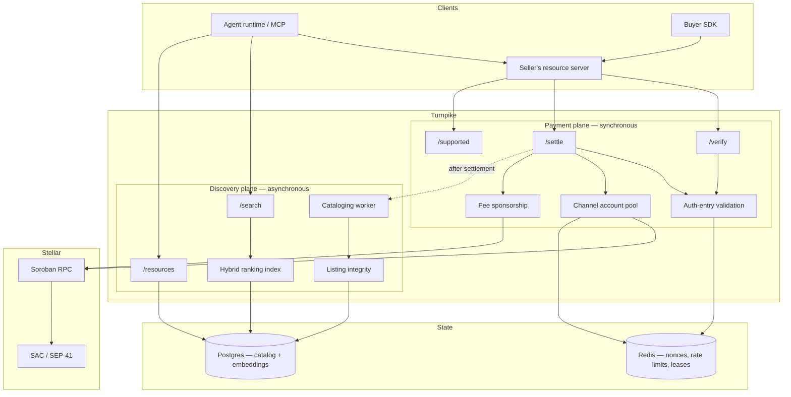

# Architecture

Turnpike is one service with two planes. They share a request path but deliberately do not share a latency path.

> **This page describes the target architecture.** The payment plane exists and runs; the discovery plane, the channel-account pool, Postgres and Redis are designed and not built. The status table at the foot of this page is authoritative about which is which.

---

## System view

---

## The two planes

### Payment plane — synchronous, latency-critical

Everything a payment needs while a client is waiting: `/verify`, `/settle`, `/supported`, authorization-entry validation, fee sponsorship, and channel-account leasing.

This plane's non-functional requirements are strict. It sits inside an HTTP request that a paying agent is blocked on, and the resource server's own facilitator client has a default timeout — currently 30 seconds in `@x402/core`. Any work that can be deferred *must* be deferred, because latency here is a failure mode: a retry budget that exceeds the client's timeout converts a recoverable rejection into a hard timeout, which is strictly worse.

That constraint is enforced in configuration, not just in review. Turnpike rejects a configuration whose retry count multiplied by retry delay exceeds 24 seconds, leaving headroom inside the client's window.

### Discovery plane — asynchronous, throughput-oriented

Cataloging, indexing, ranking, and the read APIs `/resources` and `/search`.

The cataloging worker runs **after settlement completes**, off the request path. A payment must never be slower, or fail, because the catalogue was slow or unavailable. If cataloging fails entirely, the payment still succeeded and the resource is simply not indexed yet.

The read side has the opposite profile: `/search` is latency-sensitive in its own right (an agent is waiting), but it touches no chain state and no keys, so it can be scaled, cached, and, if necessary, degraded independently.

### Why the split matters

A design that catalogues synchronously during settlement couples payment availability to index availability. It also creates an attack surface: a hostile client could slow payments for everyone by submitting listings that are expensive to process. Separating the planes means the worst a bad listing can do is affect the catalogue.

---

## State

### Postgres — catalog and embeddings

The resource catalogue, its ownership records, and the dense vectors used for semantic retrieval, with `pgvector` for similarity search. One store rather than two keeps lexical and semantic retrieval consistent: a resource and its embedding are written in the same transaction, so the two retrieval paths cannot disagree about what exists.

Holds no payer identifiers, no request bodies, and no payload material — only resource metadata and the settled recipient address that establishes listing ownership.

### Redis — nonces, rate limits, channel leases

Short-lived operational state: settled-payload markers for replay rejection, per-payer and per-IP rate limit counters, and channel-account leases. All keys are TTL-bounded; nothing here is a system of record.

### Stellar — the actual ledger

The chain is the source of truth for balances, settlement, and — importantly — for listing ownership. The catalogue's integrity model derives authority from settled on-chain payments rather than from anything a client asserts. See [Bazaar discovery](./05.bazaar.md).

---

## Infrastructure

Target deployment. Today the facilitator and demo server run as two containers from `docker compose`, with no database, no cache, and no worker; the rest of this table is Tranche work.

| Component | Choice | Rationale |
|---|---|---|
| Facilitator service | Containerised Node.js, horizontally scalable behind a load balancer | Stateless per request; all shared state in Postgres/Redis. *Built, though today it runs as a single container and holds no shared state at all.* |
| Cataloging worker | Separate process, queue-driven | Failure isolation from the payment path |
| Database | Managed Postgres with `pgvector` | Catalog, ownership, embeddings in one consistent store |
| Cache / ephemeral state | Managed Redis | Nonces, rate limits, leases |
| Chain access | Soroban RPC, with configurable endpoint and provider fallback | The public testnet pool has a documented consistency defect; see [Reliability](./07.reliability.md) |
| Key material | Environment-injected, never committed; sponsor and channel keys separated by role | See [Security](./08.security.md) |
| CI | GitHub Actions, running real settled payments against testnet on every push, plus a scheduled probe five times daily | Conformance is asserted continuously, not claimed once. *Built.* |

Self-hosting is a first-class path, not an afterthought. The entire stack runs from a clean clone with `docker compose`, and the demo path creates and funds its own accounts via Friendbot, so it requires no pre-provisioned secrets. Any team that would rather not depend on a hosted Turnpike can run their own.

---

## What is built today

| Component | Status |
|---|---|
| `/verify`, `/settle`, `/supported` — `exact` on testnet | **Built** |
| Fee sponsorship | **Built** |
| Non-null rejection reasons on every path | **Built** |
| Conformance harness vs. unmodified stock client, in CI | **Built** |
| Ledger-skew mitigation | **Built**, not yet validated against a degraded window — 105 probe payments since the fix, no skew event to test it |
| Channel account pool | Designed — Tranche 1 |
| Bazaar catalog, integrity, `/resources`, `/search`, ranking | Designed — Tranches 1–2 |
| `upto` scheme spec and Soroban contract | Designed — Tranche 2 |
| Mainnet (`stellar:pubnet`) | Designed — Tranche 3 |

The measured evidence behind the "built" rows is in [Reliability and Evidence](./07.reliability.md).